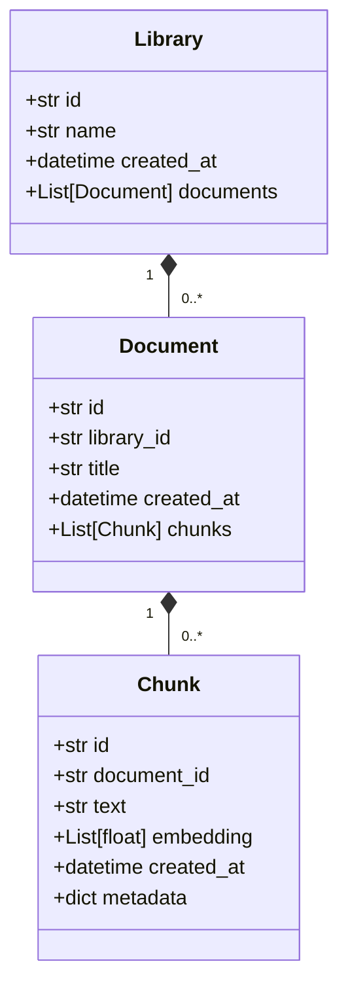

# take-home-task-stack-ai
Assessment from StackAI

## Architecture Overview

```mermaid
classDiagram
    class Library {
        +str id
        +str name
        +datetime created_at
        +List[Document] documents
    }
    
    class Document {
        +str id
        +str library_id
        +str title
        +datetime created_at
        +List[Chunk] chunks
    }
    
    class Chunk {
        +str id
        +str document_id
        +str text
        +List[float] embedding
        +datetime created_at
        +dict metadata
    }
    
    Library "1" *-- "0..*" Document
    Document "1" *-- "0..*" Chunk
```